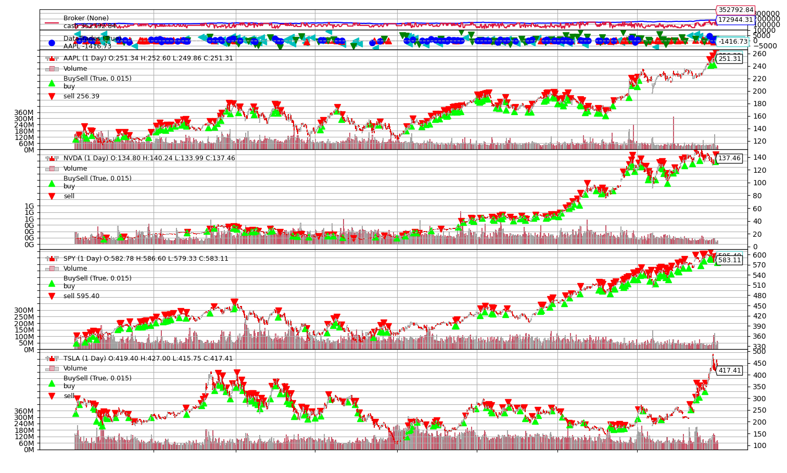
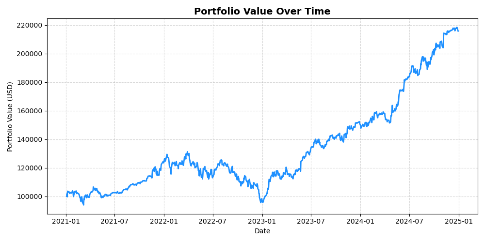
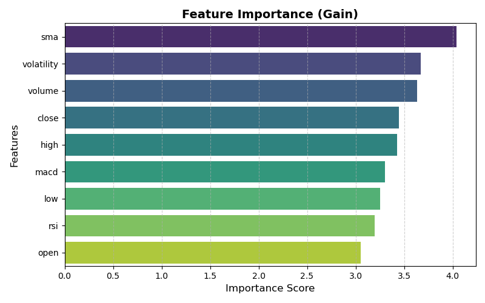

# XGBoost Back Test

## 1. Introduction

After learning quantative finance for 2 weeks, this is my first from 0 back test workflow. This report presents the results of a **XGBoost** model predicitng stocks trend, conducted using **Backtrader**. 

The goal was to find out the optimzed parameter for indicators and the model, and get the optimized result in the back test.

---

## 2. Experiment Setup

| Item | Description |
|------|--------------|
| **Framework** | Backtrader |
| **Data Source** | Yahoo Finance | 
| **Stock Code** | AAPL, NVDA, TSLA, SPY| 
| **Time Period** | *2015-01-01 to 2024-12-31* |
| **Initial Cash** | 100,000 |
| **Commission** | 2$ per trade |
| **Position Size** | 30% of the portfolio per trade   |
| **Parameters Tested** | Fast MACD: [8, 12], Slow MACD: [20, 26], RSI: [10, 14, 20], SMA: [10, 20, 30]|
| **Metrics Used** | Portfolio Value, Sharpe Ratio, Max Drawdown |

---

## 3. Strategy Logic

**XGBoost Predict Signal Strategy**

### Feature Extract
We extract features from the downloaded data, by getting everyday's values corresponding to the output of the indicator that we chose to use above, and save it into a csv.
Then, we combine all 4 features csv into one csv. Optimized parameter for the indicators has chosen base on the combination with highest average sharpe ratio. Also, everyday signal is also added to the csv (If next day > today -> 1, otherwise 0)

### Training
- Data were splitted into training (2015-01-01 to 2020-12-31) and testing (2021-01-01 to 2024-12-31).
- Optimized parameter for the XGBoost model has found by using grid search
- Features importance has printed out

### Signal Prediction
After trained, the model is used to generate probability of rising on next day and signal that for the testing set, and save in a csv.

### Back Test
The results are then put in the Back Trader framework for back test

## 4. Results Summary

### 4.1 Back Test Plot

### 4.2 Best Indicator Parameter Combination

| MACD Fast | MACD Slow | RSI  | SMA | Sharpe   |
|-----------|-----------|------|-----|----------|
| 10        | 10        | 8    | 20  | 1.02     |

---

### 4.3 Best Model Parameter Combination
The best parameter combination for the model is found by grid search, scoring by ROC AUC

| colsample_bytree | Learning Rate | Max Depth  | N Estimators | Subsample |
|------------------|---------------|------------|--------------|-----------|
| 0.8              | 0.01          | 5          | 200          | 1.0       |
 
---

## 5. Portfolio Value Plot

---

## 6. Feature Importance Plot

---

## 7. Statistical Summary

| Metric | Value | Description |
|--------|--------|-------------|
| **Final Portfolio Value** | 215,803.713$ | Portfolio value when back test end |
| **Profit Percentage** | 115.80% | Percentage earned in the back test |
| **Sharpe Ratio** | 0.84 | Risk-adjusted performance |
| **Max Drawdown** | 27.23% | Largest peak-to-trough loss |
| **Winrate** | 56.77% | Percentage of profitable trades |

---

##  8. Discussion & Insights

- The trained XGBoost model shows good performance on predicting unseen data

---

## 9. Future Improvements

- Add **Stop Loss / Take Profit** levels for better drawdown control  
- Set more condition on selling to lower the frequency of trading
- Try more indicator combinations
- Do weight combination search

---

## 10. Conclusion

This study demonstrates the train XGBoost model is capable to make profit in unseen stock market. Paper trade simulation will add once the model has been optimized.
